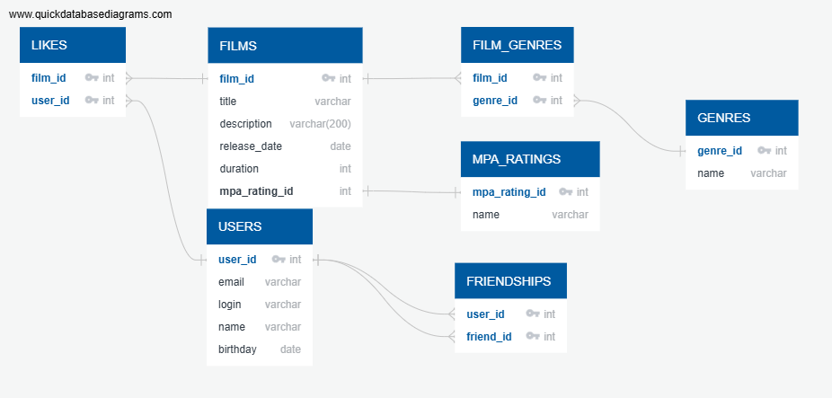

# java-filmorate
Template repository for Filmorate project.

### USERS
* user_id (PK -<): Уникальный идентификатор пользователя.
* email (varchar): Электронная почта пользователя.
* login (varchar): Логин пользователя.
* name (varchar): Имя пользователя
* birthday (date): Дата рождения пользователя.

### FILMS
* film_id (PK -<): Уникальный идентификатор фильма.
* title (varchar): Название фильма.
* description (varchar(200)): Описание фильма.
* release_date (date): Дата выпуска фильма.
* duration (int): Длительность фильма.
* mpa_rating_id (FK -): Внешний ключ, ссылающийся на таблицу MPA_RATINGS.

### MPA_RATINGS
* mpa_rating_id (PK -): Уникальный идентификатор рейтинга МРА.
* name (varchar): Название рейтинга МРА.

### GENRES
* genre_id (PK -<): Уникальный идентификатор жанра.
* name varchar

### FILM_GENRES

* film_id (PK >-): Уникальный идентификатор жанра фильма.
* genre_id (FK >-): Внешний ключ, ссылающийся на таблицу GENRES.

### LIKES

* like_id (PK): Уникальный идентификатор лайка.
* film_id (FK >-): Внешний ключ, ссылающийся на таблицу FILMS.
* user_id (FK >-): Внешний ключ, ссылающийся на таблицу USERS.

### FRIENDSHIPS

* friendship_id (PK): Уникальный идентификатор дружбы.
* user_id (FK >-): Внешний ключ, ссылающийся на таблицу USERS.
* friend_id (FK >-): Внешний ключ, ссылающийся на таблицу USERS.
* status (ENUM('UNCONFIRMED','CONFIRMED')): Статус дружбы.